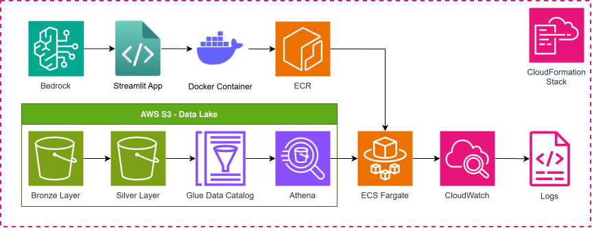
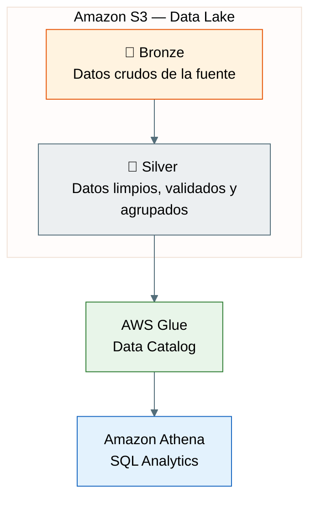
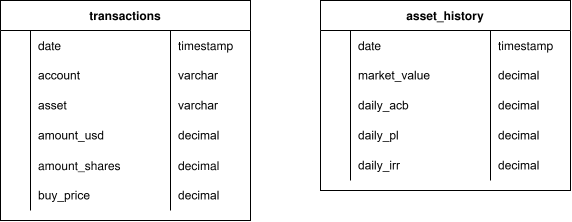

# Generador de reportes para portafolios

> Generación automática de reportes para portafolios con interfaz de lenguaje natural.

**Problema:** Para tomar decisiones oportunas y relevantes, se requiere acceso a información histórica de un portafolio de inversión así como su actualización diaria con la información más reciente. Se necesita conocer el rendimiento y volatilidad del portafolio en distintos rangos de fechas y cómo se compara este contra distintos *benchmarks*. Además, se necesita poder monitorear y entender el comportamiento del portafolio, por lo que es importante que tener acceso a explicaciones específicas sobre la información presentada.

## Propuesta de solución

### Arquitectura

Para afrontar la necesidad de acceder a la información más reciente de forma oportuna se propuso desplegar un tablero con *streamlit* por medio de ECS Fargate. El tablero se alimenta de datos de S3 por lo que puede utilizar la información más reciente con tan solo cargar la información nueva al *bucket*. Además, para asegurar que se puedan hacer consultas sobre distintos rangos temporales, se propuso guardar datos históricos en lugar de estadísticas precalculadas, registrar el esquema de los datos en *Glue* y consultarlos mediante *Athena* para hacer cálculos sobre los datos con los filtros específicos que determine el usuario. La aplicación traduce la selección de filtros a un *query* para hacer las consultas sin necesidad de que el usuario escriba código.

Por otra parte, con el fin de tener acceso a explicaciones específicas sobre la información presentada, se propuso implementar un chatbot utilizando un modelo de lenguaje por medio de Bedrock. El chatbot dispone de *tools* para calcular distintos insights del portafolio y para poder mostrar visualizaciones de la información. Además, se utilizan *guardrails* para limitar que el modelo de recomendaciones de inversión y que únicamente se limite a dar explicaciones de lo observado o a ser una interfaz de lenguaje natural para obtener datos del portafolio.

El funcionamiento del sistema se monitorea por medio de `logs` generados durante la ejecución de la aplicación utilizando *CloudWatch*.



### Organización de los datos

El **Data Lake** almacena todos la información relacionada al portafolio. Los datos se almacenan en dos capas:
-  **Bronze:** Se utiliza para guardar los todos los datos crudos, sin modificaciones. Esta capa se puede utilizar para guardar información contable relacionada al portafolio que no necesariamente es util para analizar su desempeño.
-  **Silver:** Se utiliza para guardar datos limpios y validados. Estos son los datos que se consultan desde la aplicación de streamlit.



### Capa Bronze
Hay dos tipos de datos originales: una tabla `transactions` y una tabla `asset_history` por cada combinación distinta de *cuenta* y *activo*.




### Capa Silver
Estructura del bucket dentro de la capa Silver.

**Ruta:** `data/silver`

```
├── transactions/
│   └── account=inversiones/
│       └── transactions.parquet
│   └── account=retiro/
│       └── transactions.parquet
│
└── asset_history/
    ├── account=inversiones/
    │   ├── asset=spy/
    │   │   └── year=2025/
    │   │       └── history.parquet
    │   └── asset=qqq/
    │       └── year=2025/
    │           └── history.parquet
    └── account=retiro/
        └── asset=spy/
            └── year=2025/
                └── history.parquet
```

## Cómo ejecutar el código para hacer pruebas locales
**Sincronizar uv**
```
uv sync
```

**Ejecutar un submódulo de src**
```
uv run python -m src.<nombre-submódulo>
```

**Streamlit en Docker**
1. Actualiza requirements.txt con `uv pip compile pyproject.toml -o requirements.txt`.
2. Construye la imagen con `docker build -t portfolio-app .`
3. Corre el contenedor con:
    - Powershell:
        ~~~powershell
        docker run -p 8501:8501 `
        -v ${env:USERPROFILE}\.aws:/root/.aws:ro `
        -e AWS_PROFILE=default `
        portfolio-app
        ~~~
    - Bash:
        ```bash
        docker run -p 8501:8501 \
            -v ~/.aws:/root/.aws:ro \
            -e AWS_PROFILE=default \
            portfolio-app
        ```
4. Ingresa a <http://localhost:8501>